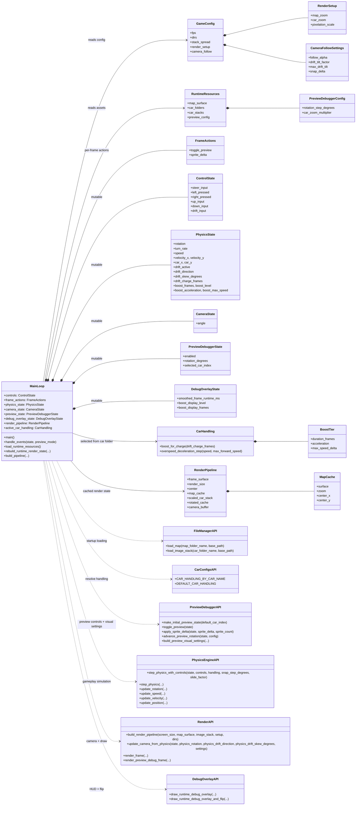
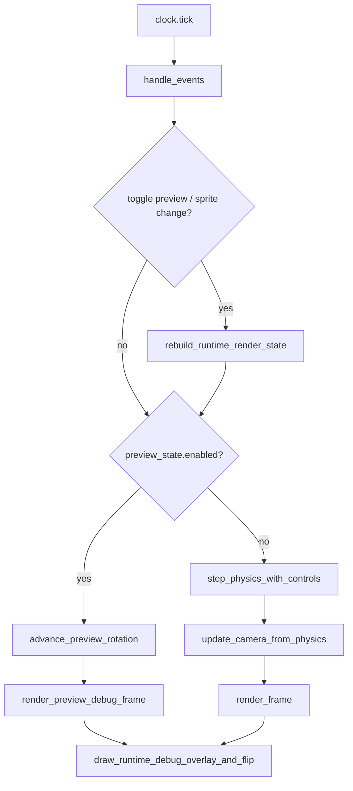

# Alpha Prototype
This branch is an alpha gameplay prototype.

Implemented:
- Driving/handling model
- Drift and boost system
- Preview mode + debug overlay

Still missing before beta:
- Menus
- Collisions
- Items
- Sound effects
- Art/polish pass

## Run
- Show launch options: `python3 main.py -h`
- Custom resolution: `python3 main.py -r 1280x720`
- Fullscreen: `python3 main.py -f`

## Controls
- `W A S D`: movement
- `Space`: drift / boost charge
- `P`: preview mode toggle
- In preview mode, `A` / `D`: switch car sprite set

## Class 'Diagram' (link and code below)
(https://mermaid.ink/img/pako:eNp1WFlv2zgQ_iuEnpytYyRukyZ6KJAmPRZoukXaPuxCAMFItEyEJgWScuwW_e87vERKdh6KeMjhnN8c6u-ilg0tyqLmROs7RlpFNpVomKK1YVKgH5WohLtE94SJL1J26HclEHq1AXJ24n6uiWg4xXRLhdEzbYihc9QpumX0GW9AgWfjkjRY9cKwDcWKatmrmuogQ9HHnvH8XjRUYSdstlgsPJfn6VhHORPZeS2FUZLrEt36X9_tO3e1Ao8oJs4duP9oyRtPuftuvdes1l5Tib55Mr2vgV-ReH3rqHQbvYyvPXkHzrQtVYmvsSdYbqniZB-5Hds__iyxBs-jkyV6cAffAu14rDtbimuisAs-E621TX0ORCX-pMR9ApshLCvWhtStOu86pNn_AHvqJ6zBGdLkNmhq-i6PwkpyLp-ddC_7wafrIWZzAEeHda9WpI5BVPYtyNQD7ZTqURRrZ-XI-DxfQbiRbQtwC4-8A51ihuKGckMy63IwhMfaUHCMia43HpR0ZaworWlwnbXr8UnfZfyNfBY5qRi8D_SgNwdR0KskEOCE96BXAquYcN3RoGlLuayZ2ePdHA2_90PE4NT-2WeaPRCyg6F0szP9BLFtaKso1dlxvSaqpdgViD9_lFKbcDBHnuJQ1jy7JXVNOWDB6og8G7LDwYsU-1QpIQREQNryKB0plsBKBXnkMSEhciMPNNhQG9q4EmAA1l0m-KCuYu43Upo1PPI9IbaaTe58w3RnS3TqdjyP0UoVMKrOWGFOQV4BsaLYr1AR0CupGoqlJvU6oKEmPPjlKiTFwJ1GtlCQj_1qZcVMzPluCzerxV9SbgYYDUTHdpT72DqtB9n76ModhBnoKbH8fA_AhHdrkqHJMA7QATzK6NUOpxvvmgBTDmo0da2gIKBQqoDQ2RG4-rZv-6nDHUhNqIS40W7mzufImgGinolqPERPMt3vraYfjKqguemDhKwmcrwPjkWlY1cmgB713AHF1rgRlGNK8KbnhnWcjfJ5T7pbm_QI4QxSKakOS3iXE_txF2Wc3hNBwKqbb38HWW4eAzpmFiG-O2MBfkNVEw39lZh1NrjZBl57SM5SOz_yIM-sD4FOOm9vHvDnm693X_7--gm__xdb-uvN_Qd3effh483PLz9wzvRyeJPQDXmi0ASYYYTj0USeNXRFIKypTZwcGSF-ZfE3pOv4HufzJC40-dlA1RKaSHjZbImoB6E4Zjy-98NttMcEzi3TPViuQ52FtWY6TT6IFhpM8toBKW4vz8yscdyCMo2OnqO4JIDdtgZzDMIRZw0NpXtyIDotWX3XgNjk1_TCFcXBaZxjBxed1CyTM-lgyc-wF463opmuwXjh-qkt8mHdmKMMqOCbbYRzZDedkfK4zyiou-hoXFxDSKOf6WQyYacX-Zh1ml02T_L27_pKikR0KuDAL4k5z9GRlkLTKPI8jLHRipl0vMyDARR4xVmXlFVi2PJPT9_lm2OJ7HKoUVzRRnwHW2DkBtOp0Rn3X6en462sRJve2GE_YRrtfSXqqDp1gUEk7u4j9tHG9ZLMfCV5iefoUvIS8-GicYzTRiifciWK2wuy-LM7HfLddBrW8WpRIjf-G-Rhg7T_ZKhEliZrVbYCHNwdm-uVOMjfkUjchsRPjLKccUZVInfT3gwDdgStxeLddCKV1htllxY7bNwXzIh9PEssvLTkWzo0tgn7kVFRxi_SoS2iV8h33qFWp1KmjbdELcTP7oFIMxjXYSkYPUrty-bLRhv02CKc8E0rukSff94Bqy3IShTzolWsKUqjejovQAx8bwNZuMKvClhjN7QqSvjZEPVUFVC-8KYj4j_YCuIzJft2XZQrwjVQvvWFj_yBxZl7a8dYUV5fOxFF-bvYFeX5crk4f3t2vnx7dXl1ebF8_WZe7OH44npx8eby7XL55nx5fnb9-urPvPjltJ4trs6A8eL1Ofy7vlxeLucFbRjMlfvw3wz2z5__AayY79o?type=png)

## Runtime Flow (Function-Level)
Use this to follow control flow in `main.py` with the actual function names:

(https://mermaid.ink/img/pako:eNpVkl1vmzAUhv8K8nXC-AwJF63WpO3aane7GkSWi0_AirGRMckylP8-x4Yq4wrD8573seURVZICytGBy3PVEKW9X7tSeOb5XlRcVkdfs-q495bLB--paIigHDCcQOh-77gn-287alnXHLxOwYnB2fvm9Z1iGjwzVdTweHX01tDeBXob2hUKPgfGKVaD0KwFrEBQULjXRMP-LiGkDTy7Tzu3GKcuh_sgyCcHemty2PN910tB6ImICvCcUtLEmBRTz4vFXotJYaaoMazxQZF2Fnq14I-CKnL-EneYPIHi5ILNMeEDZ93-P5VpE29Fr6HDXXPpWdXjM9MNrqTQSvL5TN8s-F4MHTU7w5UpV8RIyHaOTeC7BT9m6XvND6eJFqhWjKJcqwEWyAxqyW2JxhtWIt1ACyXKzSsl6liiUlxNpiPit5TtHFNyqBuUHwjvzcpp7RipTd8XYhW20hwIyqPNxs5A-Yj-oDxMVn6YBWGcJpt1kKzW6wW6oHwZ-UkaR1mwyuIsDddxeF2gv7Y28NfBKo3SKEuTONkEsZkHlGmpfroLa-_t9R9e5uDt?type=png)

## Helper File Reference
- `file_manager.py`
  - `load_map(...)`: loads one map surface at startup.
  - `load_image_stack(...)`: loads per-car sprite stacks at startup.
- `car_configs.py`
  - `CAR_HANDLING_BY_CAR_NAME`: maps folder name (`car_01`, etc.) to `CarHandling`.
  - `DEFAULT_CAR_HANDLING`: fallback handling profile.
- `preview_debugger.py`
  - `make_initial_preview_state(...)`: creates preview state.
  - `toggle_preview(...)`, `apply_sprite_delta(...)`, `advance_preview_rotation(...)`: per-frame preview controls.
  - `build_preview_visual_settings(...)`: computes preview zoom/pixelation/stack spread before pipeline rebuild.
- `physics_engine.py`
  - `step_physics_with_controls(...)`: main entry called once per gameplay frame.
  - Internally chains `step_physics(...)` -> `update_rotation(...)` -> `update_speed(...)` -> `update_velocity(...)` -> `update_position(...)`.
- `render.py`
  - `build_render_pipeline(...)`: builds render caches (startup + rebuild).
  - `update_camera_from_physics(...)`: updates camera angle each gameplay frame.
  - `render_frame(...)`: gameplay draw path.
  - `render_preview_debug_frame(...)`: preview draw path.
- `debug_overlay.py`
  - `draw_runtime_debug_overlay_and_flip(...)`: final HUD draw + present each frame.
  - `draw_runtime_debug_overlay(...)`: same draw without `pygame.display.flip()`.

## Mutation Rules (Quick Mental Model)
1. `physics_engine.step_physics_with_controls(...)` mutates `PhysicsState` in place.
2. `render.update_camera_from_physics(...)` mutates `CameraState` in place.
3. `preview_debugger.*` mutates `PreviewDebuggerState` only.
4. `debug_overlay.*` mutates `DebugOverlayState` only.
5. `RenderPipeline` is treated as cached render data and replaced only when rebuild is required (preview toggle or selected car change).

## Startup Sequence
1. Parse CLI args and create window.
2. Load map + car sprite stacks (`file_manager.py`).
3. Select the active `CarHandling` profile from `car_configs.py`.
4. Build initial `RenderPipeline` (`build_render_pipeline`).
5. Enter fixed-rate frame loop.
