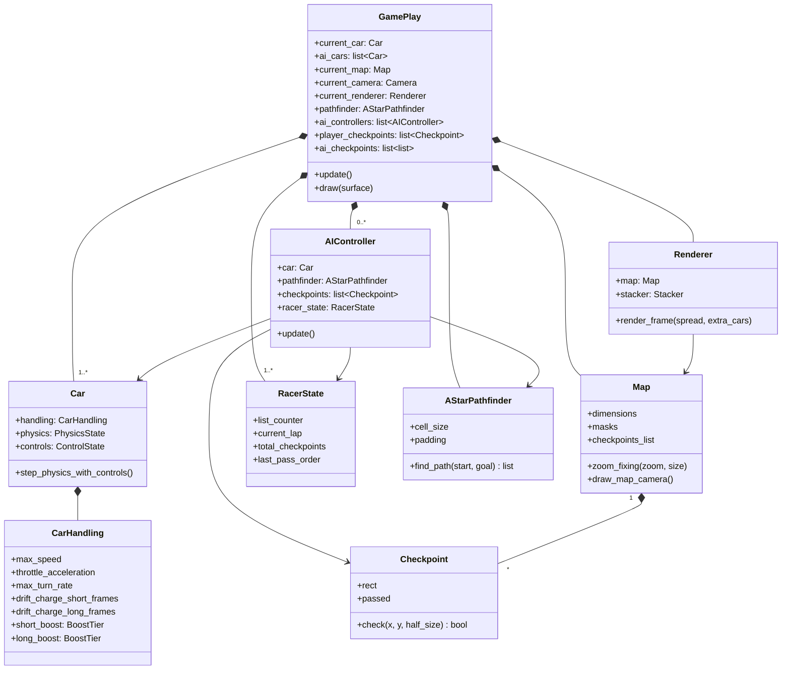

# Kar-Kart

<<<<<<< HEAD
A top-down pixel-art kart-racing game built with `pygame`. Cars are rendered
as stacks of rotated sprite slices; the camera rotates smoothly with the
car's heading and tilts during drifts; collision uses per-pixel masks
against the map layers. A CPU opponent races alongside the player using A*
pathfinding over a wall-padded occupancy grid built from the same masks.

## Running the game

Requires Python 3.10+ (for `match` statements and PEP 604 unions) and
`pygame`. The codebase otherwise uses only the Python standard library.
=======
A top-down pixel-art kart racer built with `pygame`. Cars are drawn as
stacks of rotated sprite slices, the camera rotates with the heading and
tilts on drifts, and collision runs on per-pixel masks of the map. CPU
opponents race alongside the player using A\* pathfinding over a
wall-padded grid built from the same masks.

## Getting started

Requires Python 3.10+ and `pygame`. No other dependencies.
>>>>>>> 58f0b1b9c2910f31096c89e7ae884f410df30e92

```bash
pip install pygame
python main.py
```

<<<<<<< HEAD
Controls:

| Key | Action |
| --- | --- |
| `W` / `S` | Throttle / brake-reverse |
| `A` / `D` | Steer left / right |
| `SPACE` | Hold to drift; release to trigger a boost |
| `F1` | Toggle the checkpoint debug overlay (green = passed, yellow = current target, grey = upcoming) |
| `ESC` | Back (on menu screens) |
| `RETURN` | Confirm selection |

### In-race HUD

A small panel in the top-left shows the current lap, checkpoint progress
(e.g. `CP 2 / 5`), scalar speed, and current position (`1st` / `2nd`
based on cumulative checkpoints cleared vs. the AI).
=======
## Controls

| Key       | Action                                           |
| --------- | ------------------------------------------------ |
| `W` / `S` | Throttle / brake-reverse                         |
| `A` / `D` | Steer left / right                               |
| `SPACE`   | Hold to drift — release for a boost              |
| `F1`      | Toggle checkpoint debug overlay                  |
| `ESC`     | Pause / back                                     |
| `RETURN`  | Confirm selection                                |

The in-race HUD shows current lap, checkpoint progress, speed, and
position (order of checkpoints cleared vs. the AI).
>>>>>>> 58f0b1b9c2910f31096c89e7ae884f410df30e92

## Project layout

```
Kar-kart/
<<<<<<< HEAD
├── main.py                 # Entry point: pygame init + the main loop
├── map_data.json           # Checkpoints / start / items per track
├── resources/              # Images, fonts, map layers, car sprite stacks
│   ├── assets/             #   Fonts
│   ├── maps/               #   Per-track folders (cover.png + layer PNGs)
│   ├── pictures/           #   UI images and flags
│   └── render/             #   car_01 .. car_04 sprite stacks
│
└── karkart/                # All game code lives here
    ├── app_data.py         # Shared runtime state: loaded tracks + cars
    ├── constants.py        # Colors, screen anchors, key bindings
    ├── helpers.py          # Math helpers (clamp, lerp, angle maths)
    ├── paths.py            # Absolute paths to resources/
    ├── screen_manager.py   # Router that activates one screen at a time
    │
    ├── ai/                 # CPU opponent
    │   ├── pathfinder.py   #   A* over a wall-padded occupancy grid
    │   └── ai_controller.py#   Steers a Car along the planned path
    │
    ├── physics/            # Simulation layer
    │   ├── camera.py       #   Follow-camera with drift tilt
    │   ├── car.py          #   Car dynamics, drift, boost
    │   ├── checkpoint.py   #   Single-rect checkpoint
    │   └── collision.py    #   Per-pixel map-vs-car collision
    │
    ├── rendering/          # Drawing layer
    │   ├── map.py          #   Zoomed map + collision masks
    │   ├── preview.py      #   Standalone pipeline for the car preview
    │   ├── renderer.py     #   In-game frame composition
    │   └── stacker.py      #   Pre-baked rotated car sprite cache
    │
    ├── screens/            # One file per top-level screen
    │   ├── start.py
    │   ├── race_selection.py
    │   ├── car_selection.py
    │   ├── map_selection.py
    │   ├── gameplay.py
    │   └── start_sequence.py
    │
    ├── tools/              # Developer-only utilities
    │   └── map_editor.py   #   Click-to-place checkpoints, saves map_data.json
    │
    └── ui/                 # Reusable widgets (no game knowledge)
        ├── button.py       #   Button / PaddingButton / ColorButton
        ├── card.py         #   Card / MapCard
        ├── container.py    #   Grid Container / SelectContainer / MapContainer
        └── track.py        #   Track entry (cover image + display name)
```

## How a frame flows

1. `main.py` asks the `ScreenManager` for the active screen.
2. The main loop calls `handle_event` for each pygame event, then
   `update()`, then `draw(screen)`.
3. On the gameplay screen, `update()` toggles a frame-parity flag and
   splits the work:
   * **Even frames** run the mask-based player and AI collision checks
     plus the car-to-car overlap test.
   * **Odd frames** run checkpoint bookkeeping for both cars and the
     A\* replan inside `AIController.update()`.
   * **Every frame** still advances `Car.step_physics()` for both cars,
     emits sparks, and updates the follow camera, so motion never
     stutters — only the expensive checks alternate.
4. `draw()` asks the `Renderer` to compose the frame: the `Map` blits
   itself with camera rotation, then the `Stacker` blits the car's
   rotated sprite stack at the centre of the frame. The HUD is drawn
   last, on the full-resolution display, on top of the pixelated scene.
5. If the previous frame blew the ~16.7 ms budget, `main.py` skips the
   next `draw()` call entirely and holds the last presented image for
   one extra tick. Physics still updates, so the simulation stays in
   step — only the visual is one frame stale.

## Adding a new track

1. Drop a new folder under `resources/maps/<name>/` containing:
   * `cover.png` — the thumbnail shown on the map-selection screen.
   * `0.png` — the ground layer (also used for collision-free rendering).
   * `1.png`, `2.png`, ... — additional collision/decoration layers.
2. Run the map editor to place checkpoints and a start box:

   ```bash
   python -m karkart.tools.map_editor
   ```

   Edit the `MAP_NAME` constant in that file first to point to your new
   track, then use the keybindings in the module docstring to place
   regions. The tool writes the result back to `map_data.json` on exit.

## Checkpoints and car-to-car collision

`Checkpoint.check(car_x, car_y, half_size=10.0)` tests a small square
footprint around the car against the checkpoint rect rather than a
single point. That matters for narrow checkpoints: the old point-in-rect
test could silently skip a checkpoint whenever the car's centre did not
clip it, even though the body of the car clearly crossed through.

Car-to-car collision is a simple distance test, not a mask test.
`GamePlay._check_car_to_car_collision` compares player and AI positions
against `_CAR_COLLISION_RADIUS` (world units); on overlap it pushes
both cars along the collision axis and bleeds some scalar speed, which
is enough to produce a convincing bump without per-pixel work.

## Tuning the car

Every tunable constant lives on `karkart.physics.car.CarHandling` as a
field with a default value. Rotation response, drift skew, boost tiers,
overspeed braking curves, and slip/grip blending are each isolated
blocks of that dataclass.

## AI opponent

A CPU-driven car spawns alongside the player on every race. It is built
from the same `Car`, `Stacker` and `CollisionDetector` classes the player
uses — the only difference is what writes into its `ControlState`.

### Pathfinding (`karkart/ai/pathfinder.py`)

`AStarPathfinder` builds a 2D occupancy grid once per race by sampling the
first collision mask at one cell per `cell_size` map pixels. A multi-source
breadth-first search from every wall cell then marks any free cell within
`padding` cells as blocked. That padding is what keeps the AI's racing
line clear of the walls without any hand-authored waypoints.

Path queries use A\* with 8-directional movement and a Euclidean
heuristic. If the start or goal cell happens to sit inside the padded
region (e.g. the car is clipping into a wall), a small BFS first snaps
the endpoint to the nearest free cell so planning still succeeds.

### Steering (`karkart/ai/ai_controller.py`)

`AIController` walks the map's `checkpoints_list` in order. For the
current target checkpoint it asks the pathfinder for a world-space path,
then each frame:

1. Pops any waypoint the car has passed within `WAYPOINT_RADIUS`.
2. Aims at the waypoint `LOOKAHEAD` steps ahead on the path.
3. Writes `steer_input`, `left_pressed`, `right_pressed`, and holds
   throttle via `up_input = True` (the AI does not drift).
4. Replans when it reaches a checkpoint or after
   `REPLAN_EVERY_N_WAYPOINTS` waypoints to absorb drift.

All knobs (`cell_size`, `padding`, `LOOKAHEAD`, `STEER_DEADZONE`,
`WAYPOINT_RADIUS`, `REPLAN_EVERY_N_WAYPOINTS`) are class-level constants
and safe to tune.

### Rendering

`Renderer.render_frame(stack_spread, extra_cars=...)` accepts a list of
`(Car, Stacker)` pairs and projects each one onto the camera-rotated
screen via `_world_to_screen`. The player's car still renders at screen
centre; the AI is drawn wherever it actually is in the world.
=======
├── main.py                  Entry point + main loop
├── map_data.json            Checkpoints, start grid, item spawns
├── resources/               Fonts, maps, UI art, car sprite stacks
└── karkart/                 All game code
    ├── app_data.py            Loaded tracks + selected car / map
    ├── screen_manager.py      Active-screen router
    ├── helpers.py             Math helpers (clamp, lerp, angles)
    │
    ├── ai/                    CPU opponent
    │   ├── pathfinder.py        A* on a wall-padded occupancy grid
    │   └── ai_controller.py     Steers a Car along the planned path
    │
    ├── physics/               Simulation
    │   ├── car.py               Dynamics, drift, boost, handling profiles
    │   ├── camera.py            Follow-camera with drift tilt
    │   ├── checkpoint.py        Rect-based checkpoint + racer state
    │   └── collision.py         Per-pixel map-vs-car collision
    │
    ├── rendering/             Drawing
    │   ├── map.py               Zoomed map + collision masks
    │   ├── renderer.py          Per-frame composition
    │   ├── stacker.py           Pre-baked rotated sprite cache
    │   └── preview.py           Standalone car preview pipeline
    │
    ├── screens/               One file per top-level screen
    ├── tools/                 Dev utilities (map editor)
    └── ui/                    Reusable widgets
```

## Frame flow

1. `main.py` pulls the active screen from `ScreenManager` and dispatches
   events → `update()` → `draw()`.
2. `GamePlay.update()` alternates work on even / odd frames:
   * **Even** — mask collisions (player + AI) and car-to-car overlap.
   * **Odd**  — checkpoint bookkeeping and the A\* replan in
     `AIController.update()`.
   * **Every frame** steps `Car.step_physics()` for all cars, emits
     sparks, and moves the camera — motion never stutters.
3. `draw()` composes a pixelated frame: map (camera-rotated) → cars
   (rotated sprite stacks) → HUD at full resolution.
4. If a frame busts the ~16.7 ms budget, `main.py` skips the next
   `draw()` and holds the last image. Physics keeps running so the
   simulation stays in sync.

## Handling

Every tunable constant lives on `karkart.physics.car.CarHandling` —
rotation response, drift skew, boost tiers, overspeed curves, and
slip / grip blending are isolated fields on that dataclass.

Each car model carries its own profile via `CAR_HANDLING_PROFILES`:

| Car      | Character                                       |
| -------- | ----------------------------------------------- |
| `car_01` | Balanced baseline                               |
| `car_02` | Higher top speed, looser grip                   |
| `car_03` | Punchy acceleration, lower top speed            |
| `car_04` | Sharpest turn rate, lower top speed             |

Both the player and every AI opponent look up the profile bound to their
own sprite, so opponents actually drive like their own karts.

## Checkpoints

`Checkpoint.check()` tests a 20 × 20 square around the car rather than a
single point so narrow gates still trigger when only the body of the car
clips the rect. Every racer owns its own cloned `Checkpoint` list and
`RacerState` — progression never leaks between cars.

Position is event-driven: the rank string is recomputed only when a
racer actually crosses a checkpoint. Ties on total checkpoints break by
who reached that count first.

## Car-to-car collision

A distance test against `_CAR_COLLISION_RADIUS` — cheaper than a mask
check and plenty for the bump-and-push feel. On overlap both cars are
pushed apart along the collision axis and lose some scalar speed; the
car further along the track keeps more of its momentum.

## AI opponent

Every AI spawns as a regular `Car` with its own `Stacker`,
`CollisionDetector`, `RacerState`, and `AIController`. The only
difference from the player is what writes into its `ControlState`.

### Pathfinding — `karkart/ai/pathfinder.py`

`AStarPathfinder` builds a 2D occupancy grid once per race: it samples
the wall mask at one cell per `cell_size` pixels, then a multi-source
BFS from every wall cell marks any free cell within `padding` cells as
blocked. That padding keeps the racing line clear of walls without any
hand-placed waypoints. Queries use A\* with 8-directional movement and
a Euclidean heuristic; if an endpoint lands inside the padded zone, a
small BFS snaps it to the nearest free cell so planning still succeeds.

### Steering — `karkart/ai/ai_controller.py`

For each checkpoint the controller asks the pathfinder for a world-space
path, then each AI tick:

1. Pops any waypoint within `WAYPOINT_RADIUS`.
2. Aims at the waypoint `LOOKAHEAD` steps ahead.
3. Sets `steer_input` and throttle, cutting throttle on sharp turns so
   the car can actually rotate.
4. Replans on a new goal or every `REPLAN_EVERY_N_WAYPOINTS` waypoints.

If the car gets stuck, a reverse / reorient recovery kicks in. Two
triggers feed it:

* **Stillness** — barely moving for `STILL_FRAME_LIMIT` ticks.
* **No progress** — can't get meaningfully closer to the goal for
  `NO_PROGRESS_FRAME_LIMIT` ticks (catches orbit patterns the stillness
  check misses).

During reorientation the AI forces throttle on and holds a minimum
forward speed so steering always engages — otherwise a badly-misaligned
car would coast to a stop and never turn around.

## Adding a track

1. Create `resources/maps/<name>/` with:
   * `cover.png` — thumbnail for the map-selection screen.
   * `0.png` — ground layer.
   * `1.png`, `2.png`, ... — collision / decoration layers.
2. Run the map editor to place checkpoints and a start box:

   ```bash
   python3 -m karkart.tools.map_editor
   ```

   Edit `MAP_NAME` in the module first. Keybindings are in its
   docstring. The tool writes the result back to `map_data.json` on
   exit.
>>>>>>> 58f0b1b9c2910f31096c89e7ae884f410df30e92

## Class diagram


```mermaid
classDiagram
    class GamePlay {
        +current_car: Car
        +ai_cars: list~Car~
        +current_map: Map
        +current_camera: Camera
        +current_renderer: Renderer
        +pathfinder: AStarPathfinder
        +ai_controllers: list~AIController~
        +player_checkpoints: list~Checkpoint~
        +ai_checkpoints: list~list~
        +update()
        +draw(surface)
    }

    class Car {
        +handling: CarHandling
        +physics: PhysicsState
        +controls: ControlState
        +step_physics_with_controls()
    }

    class CarHandling {
        +max_speed
        +throttle_acceleration
        +max_turn_rate
        +drift_charge_short_frames
        +drift_charge_long_frames
        +short_boost: BoostTier
        +long_boost: BoostTier
    }

    class Map {
        +dimensions
        +masks
        +checkpoints_list
        +zoom_fixing(zoom, size)
        +draw_map_camera()
    }

    class Checkpoint {
        +rect
        +passed
        +check(x, y, half_size) bool
    }

    class RacerState {
        +list_counter
        +current_lap
        +total_checkpoints
        +last_pass_order
    }

    class AIController {
        +car: Car
        +pathfinder: AStarPathfinder
        +checkpoints: list~Checkpoint~
        +racer_state: RacerState
        +update()
    }

    class AStarPathfinder {
        +cell_size
        +padding
        +find_path(start, goal) list
    }

    class Renderer {
        +map: Map
        +stacker: Stacker
        +render_frame(spread, extra_cars)
    }

    GamePlay *-- "1..*" Car
    GamePlay *-- Map
    GamePlay *-- Renderer
    GamePlay *-- AStarPathfinder
    GamePlay *-- "0..*" AIController
    GamePlay *-- "1..*" RacerState

    Car *-- CarHandling
    AIController --> Car
    AIController --> AStarPathfinder
    AIController --> RacerState
    AIController --> Checkpoint
    Map "1" *-- "*" Checkpoint
    Renderer --> Map
```
## Credits

### Music
"Backup Plan" by Zane Little Music
From the album "Another Bag of Chips"
Licensed under CC0 1.0 Universal (Public Domain)
Source: https://opengameart.org/content/10-more-chiptune-tracks-another-bag-of-chips