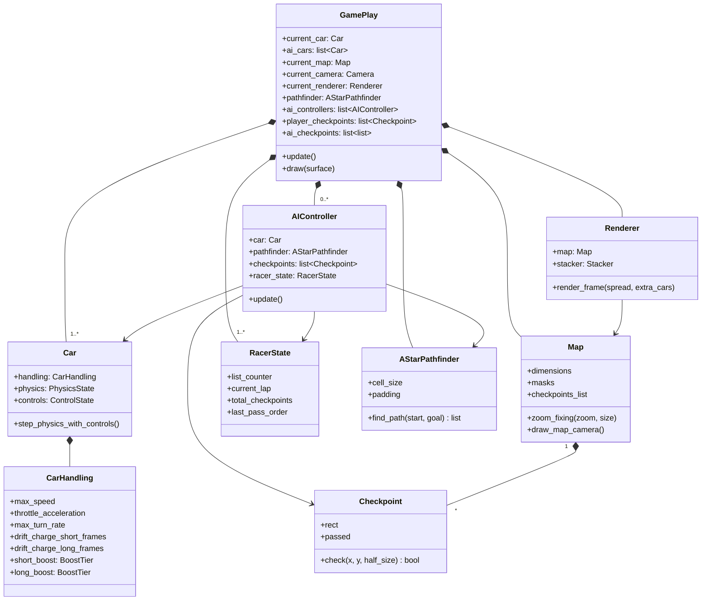

# Kar-Kart

A top-down pixel-art kart racer built with `pygame`. Cars are drawn as
stacks of rotated sprite slices, the camera rotates with the heading and
tilts on drifts, and collision runs on per-pixel masks of the map. CPU
opponents race alongside the player using A* pathfinding over a
wall-padded grid built from the same masks.

## Getting started

Requires Python 3.10+ and `pygame`. No other dependencies.

```bash
pip install pygame
python main.py
```

## Controls

| Key       | Action                                           |
| --------- | ------------------------------------------------ |
| `W` / `S` | Throttle / brake-reverse                         |
| `A` / `D` | Steer left / right                               |
| `SPACE`   | Hold to drift — release for a boost              |
| `F1`      | Toggle checkpoint debug overlay                  |
| `ESC`     | Pause / back                                     |
| `RETURN`  | Confirm selection                                |

The in-race HUD shows current lap, checkpoint progress, speed, and
position (order of checkpoints cleared vs. the AI).

## Project layout

```
Kar-kart/
├── main.py                  Entry point + main loop
├── map_data.json            Checkpoints, start grid, item spawns
├── resources/               Fonts, maps, UI art, car sprite stacks
└── karkart/                 All game code
    ├── app_data.py            Loaded tracks + selected car / map
    ├── constants.py          Colors, screen anchors, key bindings
    ├── helpers.py            Math helpers (clamp, lerp, angles)
    ├── paths.py              Absolute paths to resources
    ├── screen_manager.py     Active-screen router
    │
    ├── ai/                   CPU opponent
    │   ├── pathfinder.py      A* on a wall-padded occupancy grid
    │   └── ai_controller.py   Steers a Car along the planned path
    │
    ├── physics/              Simulation
    │   ├── car.py             Dynamics, drift, boost, handling profiles
    │   ├── camera.py          Follow-camera with drift tilt
    │   ├── checkpoint.py      Rect-based checkpoint + racer state
    │   └── collision.py       Per-pixel map-vs-car collision
    │
    ├── rendering/            Drawing
    │   ├── map.py             Zoomed map + collision masks
    │   ├── renderer.py        Per-frame composition
    │   ├── stacker.py         Pre-baked rotated sprite cache
    │   └── preview.py         Standalone car preview pipeline
    │
    ├── screens/              One file per top-level screen
    │   ├── start.py
    │   ├── race_selection.py
    │   ├── car_selection.py
    │   ├── map_selection.py
    │   ├── gameplay.py
    │   └── start_sequence.py
    │
    ├── tools/                Dev utilities (map editor)
    │   └── map_editor.py      Click-to-place checkpoints, saves map_data.json
    │
    └── ui/                   Reusable widgets
        ├── button.py         Button / PaddingButton / ColorButton
        ├── card.py           Card / MapCard
        ├── container.py      Grid Container / SelectContainer / MapContainer
        └── track.py          Track entry (cover image + display name)
```

## Frame flow

1. `main.py` pulls the active screen from `ScreenManager` and dispatches
   events → `update()` → `draw()`.
2. `GamePlay.update()` alternates work on even / odd frames:
   * **Even** — mask collisions (player + AI) and car-to-car overlap.
   * **Odd**  — checkpoint bookkeeping and the A* replan in
     `AIController.update()`.
   * **Every frame** steps `Car.step_physics()` for all cars, emits
     sparks, and moves the camera — motion never stutters.
3. `draw()` composes a pixelated frame: map (camera-rotated) → cars
   (rotated sprite stacks) → HUD at full resolution.
4. If a frame busts the ~16.7 ms budget, `main.py` skips the next
   `draw()` and holds the last image. Physics keeps running so the
   simulation stays in sync.

## Handling

Every tunable constant lives on `karkart.physics.car.CarHandling` —
rotation response, drift skew, boost tiers, overspeed curves, and
slip / grip blending are isolated fields on that dataclass.

## Checkpoints

`Checkpoint.check()` tests a 20 × 20 square around the car rather than a
single point so narrow gates still trigger when only the body of the car
clips the rect. Every racer owns its own cloned `Checkpoint` list and
`RacerState` — progression never leaks between cars.

## Car-to-car collision

A distance test against `_CAR_COLLISION_RADIUS` keeps the bump-and-push
feel cheap. On overlap both cars are pushed apart along the collision
axis and lose some scalar speed; the car further along the track keeps
more of its momentum.

## AI opponent

Every AI spawns as a regular `Car` with its own `Stacker`,
`CollisionDetector`, `RacerState`, and `AIController`. The only
difference from the player is what writes into its `ControlState`.

### Pathfinding — `karkart/ai/pathfinder.py`

`AStarPathfinder` builds a 2D occupancy grid once per race: it samples
the wall mask at one cell per `cell_size` pixels, then a multi-source
BFS from every wall cell marks any free cell within `padding` cells as
blocked. That padding keeps the racing line clear of walls without any
hand-placed waypoints. Queries use A* with 8-directional movement and a
Euclidean heuristic; if an endpoint lands inside the padded zone, a
small BFS snaps it to the nearest free cell so planning still succeeds.

### Steering — `karkart/ai/ai_controller.py`

For each checkpoint the controller asks the pathfinder for a world-space
path, then each AI tick:

1. Pops any waypoint within `WAYPOINT_RADIUS`.
2. Aims at the waypoint `LOOKAHEAD` steps ahead.
3. Sets `steer_input` and throttle, cutting throttle on sharp turns so
   the car can actually rotate.
4. Replans on a new goal or every `REPLAN_EVERY_N_WAYPOINTS` waypoints.

If the car gets stuck, a reverse / reorient recovery kicks in. Two
triggers feed it:

* **Stillness** — barely moving for `STILL_FRAME_LIMIT` ticks.
* **No progress** — can't get meaningfully closer to the goal for
  `NO_PROGRESS_FRAME_LIMIT` ticks.

During reorientation the AI forces throttle on and holds a minimum
forward speed so steering always engages.

## Adding a track

1. Create `resources/maps/<name>/` with:
   * `cover.png` — thumbnail for the map-selection screen.
   * `0.png` — ground layer.
   * `1.png`, `2.png`, ... — collision / decoration layers.
2. Run the map editor to place checkpoints and a start box:

   ```bash
   python3 -m karkart.tools.map_editor
   ```

   Edit `MAP_NAME` in the module first. Keybindings are in its
docstring. The tool writes the result back to `map_data.json` on
exit.

## Class diagram


```mermaid
classDiagram
    class GamePlay {
        +current_car: Car
        +ai_cars: list~Car~
        +current_map: Map
        +current_camera: Camera
        +current_renderer: Renderer
        +pathfinder: AStarPathfinder
        +ai_controllers: list~AIController~
        +player_checkpoints: list~Checkpoint~
        +ai_checkpoints: list~list~
        +update()
        +draw(surface)
    }

    class Car {
        +handling: CarHandling
        +physics: PhysicsState
        +controls: ControlState
        +step_physics_with_controls()
    }

    class CarHandling {
        +max_speed
        +throttle_acceleration
        +max_turn_rate
        +drift_charge_short_frames
        +drift_charge_long_frames
        +short_boost: BoostTier
        +long_boost: BoostTier
    }

    class Map {
        +dimensions
        +masks
        +checkpoints_list
        +zoom_fixing(zoom, size)
        +draw_map_camera()
    }

    class Checkpoint {
        +rect
        +passed
        +check(x, y, half_size) bool
    }

    class RacerState {
        +list_counter
        +current_lap
        +total_checkpoints
        +last_pass_order
    }

    class AIController {
        +car: Car
        +pathfinder: AStarPathfinder
        +checkpoints: list~Checkpoint~
        +racer_state: RacerState
        +update()
    }

    class AStarPathfinder {
        +cell_size
        +padding
        +find_path(start, goal) list
    }

    class Renderer {
        +map: Map
        +stacker: Stacker
        +render_frame(spread, extra_cars)
    }

    GamePlay *-- "1..*" Car
    GamePlay *-- Map
    GamePlay *-- Renderer
    GamePlay *-- AStarPathfinder
    GamePlay *-- "0..*" AIController
    GamePlay *-- "1..*" RacerState

    Car *-- CarHandling
    AIController --> Car
    AIController --> AStarPathfinder
    AIController --> RacerState
    AIController --> Checkpoint
    Map "1" *-- "*" Checkpoint
    Renderer --> Map
```
## Credits

### Music
"Backup Plan" by Zane Little Music
From the album "Another Bag of Chips"
Licensed under CC0 1.0 Universal (Public Domain)
Source: https://opengameart.org/content/10-more-chiptune-tracks-another-bag-of-chips
