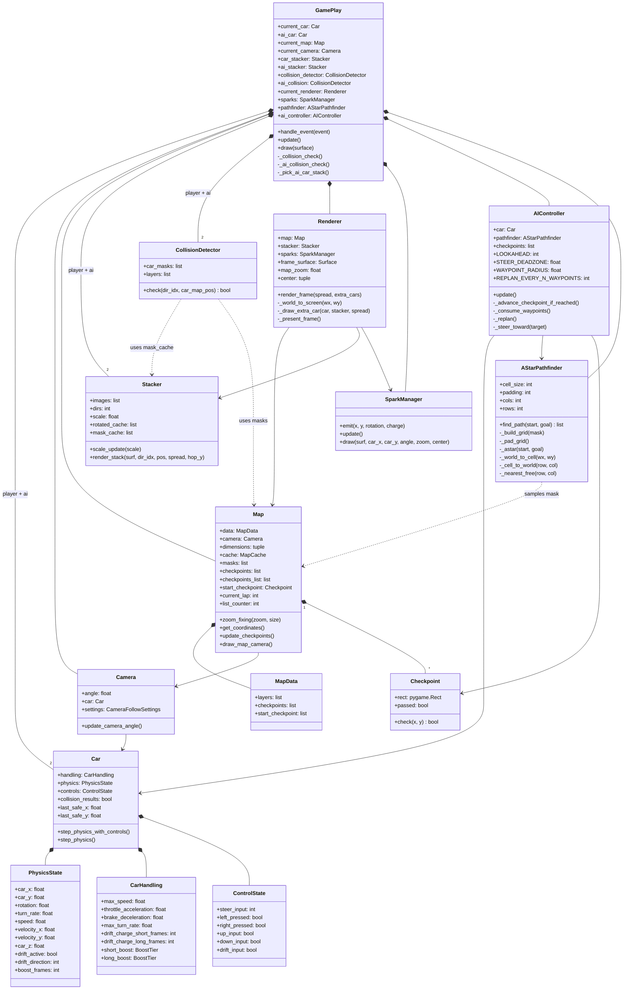

# Kar-Kart

A top-down pixel-art kart-racing game built with `pygame`. Cars are rendered
as stacks of rotated sprite slices; the camera rotates smoothly with the
car's heading and tilts during drifts; collision uses per-pixel masks
against the map layers. A CPU opponent races alongside the player using A*
pathfinding over a wall-padded occupancy grid built from the same masks.

## Running the game

Requires Python 3.10+ (for `match` statements and PEP 604 unions) and
`pygame`. The codebase otherwise uses only the Python standard library.

```bash
pip install pygame
python main.py
```

Controls:

| Key | Action |
| --- | --- |
| `W` / `S` | Throttle / brake-reverse |
| `A` / `D` | Steer left / right |
| `SPACE` | Hold to drift; release to trigger a boost |
| `ESC` | Back (on menu screens) |
| `RETURN` | Confirm selection |

## Project layout

```
Kar-kart/
├── main.py                 # Entry point: pygame init + the main loop
├── map_data.json           # Checkpoints / start / items per track
├── resources/              # Images, fonts, map layers, car sprite stacks
│   ├── assets/             #   Fonts
│   ├── maps/               #   Per-track folders (cover.png + layer PNGs)
│   ├── pictures/           #   UI images and flags
│   └── render/             #   car_01 .. car_04 sprite stacks
│
└── karkart/                # All game code lives here
    ├── app_data.py         # Shared runtime state: loaded tracks + cars
    ├── constants.py        # Colors, screen anchors, key bindings
    ├── helpers.py          # Math helpers (clamp, lerp, angle maths)
    ├── paths.py            # Absolute paths to resources/
    ├── screen_manager.py   # Router that activates one screen at a time
    │
    ├── ai/                 # CPU opponent
    │   ├── pathfinder.py   #   A* over a wall-padded occupancy grid
    │   └── ai_controller.py#   Steers a Car along the planned path
    │
    ├── physics/            # Simulation layer
    │   ├── camera.py       #   Follow-camera with drift tilt
    │   ├── car.py          #   Car dynamics, drift, boost
    │   ├── checkpoint.py   #   Single-rect checkpoint
    │   └── collision.py    #   Per-pixel map-vs-car collision
    │
    ├── rendering/          # Drawing layer
    │   ├── map.py          #   Zoomed map + collision masks
    │   ├── preview.py      #   Standalone pipeline for the car preview
    │   ├── renderer.py     #   In-game frame composition
    │   └── stacker.py      #   Pre-baked rotated car sprite cache
    │
    ├── screens/            # One file per top-level screen
    │   ├── start.py
    │   ├── race_selection.py
    │   ├── car_selection.py
    │   ├── map_selection.py
    │   ├── gameplay.py
    │   └── start_sequence.py
    │
    ├── tools/              # Developer-only utilities
    │   └── map_editor.py   #   Click-to-place checkpoints, saves map_data.json
    │
    └── ui/                 # Reusable widgets (no game knowledge)
        ├── button.py       #   Button / PaddingButton / ColorButton
        ├── card.py         #   Card / MapCard
        ├── container.py    #   Grid Container / SelectContainer / MapContainer
        └── track.py        #   Track entry (cover image + display name)
```

## How a frame flows

1. `main.py` asks the `ScreenManager` for the active screen.
2. The main loop calls `handle_event` for each pygame event, then
   `update()`, then `draw(screen)`.
3. On the gameplay screen, `update()` runs `CollisionDetector.check()`,
   advances the `Car.step_physics()` state, updates the follow camera,
   and ticks checkpoints.
4. `draw()` asks the `Renderer` to compose the frame: the `Map` blits
   itself with camera rotation, then the `Stacker` blits the car's
   rotated sprite stack at the centre of the frame.

## Adding a new track

1. Drop a new folder under `resources/maps/<name>/` containing:
   * `cover.png` — the thumbnail shown on the map-selection screen.
   * `0.png` — the ground layer (also used for collision-free rendering).
   * `1.png`, `2.png`, ... — additional collision/decoration layers.
2. Run the map editor to place checkpoints and a start box:

   ```bash
   python -m karkart.tools.map_editor
   ```

   Edit the `MAP_NAME` constant in that file first to point to your new
   track, then use the keybindings in the module docstring to place
   regions. The tool writes the result back to `map_data.json` on exit.

## Tuning the car

Every tunable constant lives on `karkart.physics.car.CarHandling` as a
field with a default value. Rotation response, drift skew, boost tiers,
overspeed braking curves, and slip/grip blending are each isolated
blocks of that dataclass.

## AI opponent

A CPU-driven car spawns alongside the player on every race. It is built
from the same `Car`, `Stacker` and `CollisionDetector` classes the player
uses — the only difference is what writes into its `ControlState`.

### Pathfinding (`karkart/ai/pathfinder.py`)

`AStarPathfinder` builds a 2D occupancy grid once per race by sampling the
first collision mask at one cell per `cell_size` map pixels. A multi-source
breadth-first search from every wall cell then marks any free cell within
`padding` cells as blocked. That padding is what keeps the AI's racing
line clear of the walls without any hand-authored waypoints.

Path queries use A\* with 8-directional movement and a Euclidean
heuristic. If the start or goal cell happens to sit inside the padded
region (e.g. the car is clipping into a wall), a small BFS first snaps
the endpoint to the nearest free cell so planning still succeeds.

### Steering (`karkart/ai/ai_controller.py`)

`AIController` walks the map's `checkpoints_list` in order. For the
current target checkpoint it asks the pathfinder for a world-space path,
then each frame:

1. Pops any waypoint the car has passed within `WAYPOINT_RADIUS`.
2. Aims at the waypoint `LOOKAHEAD` steps ahead on the path.
3. Writes `steer_input`, `left_pressed`, `right_pressed`, and holds
   throttle via `up_input = True` (the AI does not drift).
4. Replans when it reaches a checkpoint or after
   `REPLAN_EVERY_N_WAYPOINTS` waypoints to absorb drift.

All knobs (`cell_size`, `padding`, `LOOKAHEAD`, `STEER_DEADZONE`,
`WAYPOINT_RADIUS`, `REPLAN_EVERY_N_WAYPOINTS`) are class-level constants
and safe to tune.

### Rendering

`Renderer.render_frame(stack_spread, extra_cars=...)` accepts a list of
`(Car, Stacker)` pairs and projects each one onto the camera-rotated
screen via `_world_to_screen`. The player's car still renders at screen
centre; the AI is drawn wherever it actually is in the world.

## Class diagram


```mermaid
classDiagram
    class GamePlay {
        +current_car: Car
        +ai_car: Car
        +current_map: Map
        +current_camera: Camera
        +car_stacker: Stacker
        +ai_stacker: Stacker
        +collision_detector: CollisionDetector
        +ai_collision: CollisionDetector
        +current_renderer: Renderer
        +sparks: SparkManager
        +pathfinder: AStarPathfinder
        +ai_controller: AIController
        +handle_event(event)
        +update()
        +draw(surface)
        -_collision_check()
        -_ai_collision_check()
        -_pick_ai_car_stack()
    }

    class Car {
        +handling: CarHandling
        +physics: PhysicsState
        +controls: ControlState
        +collision_results: bool
        +last_safe_x: float
        +last_safe_y: float
        +step_physics_with_controls()
        +step_physics()
    }

    class PhysicsState {
        +car_x: float
        +car_y: float
        +rotation: float
        +turn_rate: float
        +speed: float
        +velocity_x: float
        +velocity_y: float
        +car_z: float
        +drift_active: bool
        +drift_direction: int
        +boost_frames: int
    }

    class CarHandling {
        +max_speed: float
        +throttle_acceleration: float
        +brake_deceleration: float
        +max_turn_rate: float
        +drift_charge_short_frames: int
        +drift_charge_long_frames: int
        +short_boost: BoostTier
        +long_boost: BoostTier
    }

    class ControlState {
        +steer_input: int
        +left_pressed: bool
        +right_pressed: bool
        +up_input: bool
        +down_input: bool
        +drift_input: bool
    }

    class Camera {
        +angle: float
        +car: Car
        +settings: CameraFollowSettings
        +update_camera_angle()
    }

    class Map {
        +data: MapData
        +camera: Camera
        +dimensions: tuple
        +cache: MapCache
        +masks: list
        +checkpoints: list
        +checkpoints_list: list
        +start_checkpoint: Checkpoint
        +current_lap: int
        +list_counter: int
        +zoom_fixing(zoom, size)
        +get_coordinates()
        +update_checkpoints()
        +draw_map_camera()
    }

    class MapData {
        +layers: list
        +checkpoints: list
        +start_checkpoint: list
    }

    class Checkpoint {
        +rect: pygame.Rect
        +passed: bool
        +check(x, y) bool
    }

    class Stacker {
        +images: list
        +dirs: int
        +scale: float
        +rotated_cache: list
        +mask_cache: list
        +scale_update(scale)
        +render_stack(surf, dir_idx, pos, spread, hop_y)
    }

    class Renderer {
        +map: Map
        +stacker: Stacker
        +sparks: SparkManager
        +frame_surface: Surface
        +map_zoom: float
        +center: tuple
        +render_frame(spread, extra_cars)
        -_world_to_screen(wx, wy)
        -_draw_extra_car(car, stacker, spread)
        -_present_frame()
    }

    class CollisionDetector {
        +car_masks: list
        +layers: list
        +check(dir_idx, car_map_pos) bool
    }

    class SparkManager {
        +emit(x, y, rotation, charge)
        +update()
        +draw(surf, car_x, car_y, angle, zoom, center)
    }

    class AIController {
        +car: Car
        +pathfinder: AStarPathfinder
        +checkpoints: list
        +LOOKAHEAD: int
        +STEER_DEADZONE: float
        +WAYPOINT_RADIUS: float
        +REPLAN_EVERY_N_WAYPOINTS: int
        +update()
        -_advance_checkpoint_if_reached()
        -_consume_waypoints()
        -_replan()
        -_steer_toward(target)
    }

    class AStarPathfinder {
        +cell_size: int
        +padding: int
        +cols: int
        +rows: int
        +find_path(start, goal) list
        -_build_grid(mask)
        -_pad_grid()
        -_astar(start, goal)
        -_world_to_cell(wx, wy)
        -_cell_to_world(row, col)
        -_nearest_free(row, col)
    }

    GamePlay *-- "2" Car : player + ai
    GamePlay *-- Camera
    GamePlay *-- Map
    GamePlay *-- "2" Stacker : player + ai
    GamePlay *-- "2" CollisionDetector : player + ai
    GamePlay *-- Renderer
    GamePlay *-- SparkManager
    GamePlay *-- AIController
    GamePlay *-- AStarPathfinder

    Car *-- PhysicsState
    Car *-- CarHandling
    Car *-- ControlState

    Camera --> Car
    Map *-- MapData
    Map --> Camera
    Map "1" *-- "*" Checkpoint

    Renderer --> Map
    Renderer --> Stacker
    Renderer --> SparkManager

    CollisionDetector ..> Stacker : uses mask_cache
    CollisionDetector ..> Map : uses masks

    AIController --> Car
    AIController --> AStarPathfinder
    AIController --> Checkpoint
    AStarPathfinder ..> Map : samples mask
```
